# C++学习笔记

---

## 目录

- [第一部分 C++基础](#第一部分-c基础)
  - [第1章 C++简介](#第1章-c简介)
  - [第2章 数据类型与变量](#第2章-数据类型与变量)
  - [第3章 运算符与表达式](#第3章-运算符与表达式)
  - [第4章 流程控制](#第4章-流程控制)
  - [第5章 函数](#第5章-函数)
  - [第6章 数组与指针](#第6章-数组与指针)
- [第二部分 面向对象编程](#第二部分-面向对象编程)
  - [第7章 类与对象](#第7章-类与对象)
  - [第8章 继承与多态](#第8章-继承与多态)
  - [第9章 模板](#第9章-模板)
  - [第10章 STL标准库](#第10章-stl标准库)
- [第三部分 C++11新特性](#第三部分-c11新特性)
- [第四部分 C++14新特性](#第四部分-c14新特性)
- [第五部分 C++17新特性](#第五部分-c17新特性)
- [第六部分 C++20新特性](#第六部分-c20新特性)

---

# 第一部分 C++基础

本部分介绍C++编程语言的基础知识，包括数据类型、运算符、流程控制、函数、数组和指针等核心概念。

## 第1章 C++简介

### 1.1 什么是C++

C++是一种静态类型的、编译式的、通用的、大小写敏感的、不规则的编程语言，支持过程化编程、面向对象编程和泛型编程。

C++被认为是一种中级语言，它综合了高级语言和低级语言的特点。

C++是C语言的超集，任何合法的C程序都是合法的C++程序。

### 1.2 C++的历史

C++由Bjarne Stroustrup于1979年开始开发，最初命名为「C with Classes」，1983年更名为C++。

**C++标准化历程：**

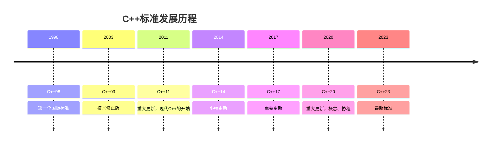

### 1.3 第一个C++程序

```cpp
#include <iostream>
using namespace std;

int main() {
    cout << "Hello, World!" << endl;
    return 0;
}
```

**程序解析：**
- `#include <iostream>`：引入输入输出流库
- `using namespace std`：使用标准命名空间
- `int main()`：程序入口函数
- `cout <<`：输出操作
- `return 0`：程序正常结束

### 1.4 编译与执行

C++程序需要经过编译才能执行：

```bash
# 使用g++编译
g++ hello.cpp -o hello

# 执行程序
./hello
```


---

## 第2章 数据类型与变量

### 2.1 基本数据类型

C++提供以下基本数据类型：

| 类型 | 大小（典型） | 范围 |
|------|-------------|------|
| bool | 1字节 | true/false |
| char | 1字节 | -128 ~ 127 |
| short | 2字节 | -32768 ~ 32767 |
| int | 4字节 | 约-21亿 ~ 21亿 |
| long | 4/8字节 | 平台相关 |
| long long | 8字节 | 约-9e18 ~ 9e18 |
| float | 4字节 | 约6位精度 |
| double | 8字节 | 约15位精度 |

### 2.2 变量定义

变量是程序中用于存储数据的命名存储位置。

```cpp
// 变量定义
int age = 25;
double salary = 5000.50;
char grade = 'A';
bool isActive = true;

// 常量定义
const double PI = 3.14159;
constexpr int MAX_SIZE = 100;  // C++11
```

### 2.3 类型修饰符

类型修饰符用于改变基本类型的含义：

- **signed**：有符号（默认）
- **unsigned**：无符号
- **short**：短整型
- **long**：长整型
- **long long**：长长整型（C++11）

```cpp
// 类型修饰符示例
unsigned int count = 100;
short int small = 10;
long int big = 1000000;
long long int huge = 10000000000LL;  // C++11
```

### 2.4 类型推导

C++11引入了auto关键字，用于自动推导变量类型：

```cpp
auto i = 10;        // int
auto d = 3.14;      // double
auto s = "hello";   // const char*
auto v = {1, 2, 3}; // std::initializer_list<int>
```

### 2.5 字符串类型

C++提供两种字符串类型：

```cpp
// C风格字符串
char str1[] = "Hello";

// C++ string类
#include <string>
string str2 = "Hello";
string str3 = "World";
string result = str2 + " " + str3;  // 字符串连接
```

---

## 第3章 运算符与表达式

### 3.1 算术运算符

```cpp
int a = 10, b = 3;
int sum = a + b;      // 13
int diff = a - b;     // 7
int prod = a * b;     // 30
int quot = a / b;     // 3
int rem = a % b;      // 1
```

### 3.2 关系运算符

```cpp
bool r1 = (a == b);  // false
bool r2 = (a != b);  // true
bool r3 = (a > b);   // true
bool r4 = (a < b);   // false
bool r5 = (a >= b);  // true
bool r6 = (a <= b);  // false
```

### 3.3 逻辑运算符

```cpp
bool x = true, y = false;
bool l1 = x && y;  // false (与)
bool l2 = x || y;  // true  (或)
bool l3 = !x;      // false (非)
```

### 3.4 位运算符

```cpp
unsigned int m = 5, n = 3;
unsigned int b1 = m & n;   // 1  (按位与)
unsigned int b2 = m | n;   // 7  (按位或)
unsigned int b3 = m ^ n;   // 6  (按位异或)
unsigned int b4 = ~m;      // 按位取反
unsigned int b5 = m << 1;  // 10 (左移)
unsigned int b6 = m >> 1;  // 2  (右移)
```

### 3.5 赋值运算符

```cpp
int x = 10;
x += 5;   // x = x + 5
x -= 3;   // x = x - 3
x *= 2;   // x = x * 2
x /= 4;   // x = x / 4
x %= 3;   // x = x % 3
```

### 3.6 自增自减运算符

```cpp
int i = 5;
int a = ++i;  // 前缀：先增后用，a=6, i=6
int b = i++;  // 后缀：先用后增，b=6, i=7
```

### 3.7 条件运算符

```cpp
int max = (a > b) ? a : b;  // 三元运算符
```

### 3.8 sizeof运算符

```cpp
cout << sizeof(int) << endl;     // 4
cout << sizeof(double) << endl;  // 8

int arr[10];
cout << sizeof(arr) << endl;     // 40
cout << sizeof(arr[0]) << endl;  // 4
```

---

## 第4章 流程控制

### 4.1 if语句

```cpp
if (condition) {
    // 条件为真时执行
} else if (another_condition) {
    // 另一个条件为真时执行
} else {
    // 其他情况执行
}
```

### 4.2 switch语句

```cpp
switch (expression) {
    case value1:
        // 代码块1
        break;
    case value2:
        // 代码块2
        break;
    default:
        // 默认代码块
}
```

### 4.3 for循环

```cpp
// 传统for循环
for (int i = 0; i < 10; i++) {
    cout << i << endl;
}

// 范围for循环 (C++11)
vector<int> vec = {1, 2, 3, 4, 5};
for (auto& elem : vec) {
    cout << elem << endl;
}
```

### 4.4 while循环

```cpp
// while循环
while (condition) {
    // 循环体
}

// do-while循环
do {
    // 循环体
} while (condition);
```

### 4.5 跳转语句

```cpp
break;      // 跳出循环或switch
continue;   // 跳过当前迭代
goto label; // 跳转到标签（不推荐）
return;     // 从函数返回
```

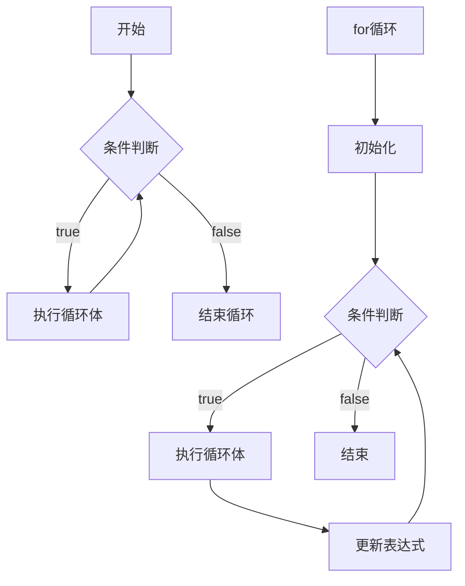

---

## 第5章 函数

### 5.1 函数定义

```cpp
// 函数声明
return_type function_name(parameter_list);

// 函数定义
return_type function_name(parameter_list) {
    // 函数体
    return value;
}
```

### 5.2 函数参数传递

```cpp
// 值传递
void byValue(int x) { x = 10; }

// 指针传递
void byPointer(int* x) { *x = 10; }

// 引用传递
void byReference(int& x) { x = 10; }

// 使用
int a = 5;
byValue(a);      // a 仍为 5
byPointer(&a);   // a 变为 10
byReference(a);  // a 变为 10
```

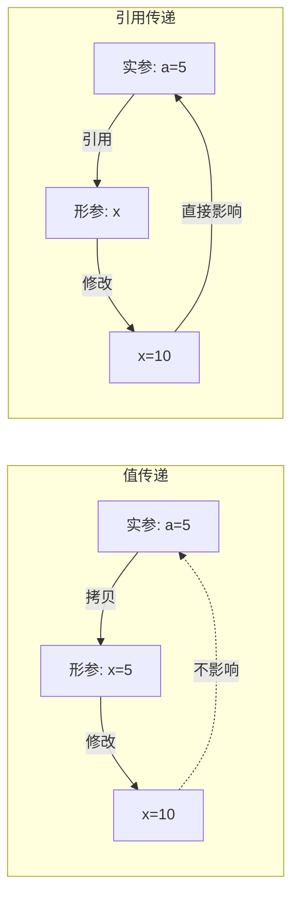

### 5.3 默认参数

```cpp
void print(int x, int y = 10, int z = 20) {
    cout << x << " " << y << " " << z << endl;
}

print(1);        // 1 10 20
print(1, 2);     // 1 2 20
print(1, 2, 3);  // 1 2 3
```

### 5.4 函数重载

```cpp
int add(int a, int b) { return a + b; }
double add(double a, double b) { return a + b; }
int add(int a, int b, int c) { return a + b + c; }

// 使用
cout << add(1, 2) << endl;       // 3
cout << add(1.5, 2.5) << endl;   // 4.0
cout << add(1, 2, 3) << endl;    // 6
```

### 5.5 内联函数

```cpp
inline int max(int a, int b) {
    return (a > b) ? a : b;
}
```

### 5.6 Lambda表达式 (C++11)

```cpp
// 基本语法
auto lambda = [](int x, int y) -> int {
    return x + y;
};

// 捕获列表
int a = 10, b = 20;
auto f1 = [a, b]() { return a + b; };      // 值捕获
auto f2 = [&a, &b]() { return a + b; };    // 引用捕获
auto f3 = [=]() { return a + b; };         // 隐式值捕获
auto f4 = [&]() { return a + b; };         // 隐式引用捕获
auto f5 = [=, &a]() { return a + b; };     // 混合捕获
```

```mermaid
flowchart TD
    A[Lambda表达式] --> B[捕获列表]
    A --> C[参数列表]
    A --> D[返回类型]
    A --> E[函数体]
    
    B --> B1[[=] 值捕获]
    B --> B2[[&] 引用捕获]
    B --> B3[[this] 捕获this]
    B --> B4[[a, &b] 混合捕获]
```

---

## 第6章 数组与指针

### 6.1 数组

```cpp
// 一维数组
int arr[5] = {1, 2, 3, 4, 5};
int arr2[] = {1, 2, 3};  // 自动推断大小

// 二维数组
int matrix[3][4] = {
    {1, 2, 3, 4},
    {5, 6, 7, 8},
    {9, 10, 11, 12}
};

// 数组遍历
for (int i = 0; i < 5; i++) {
    cout << arr[i] << endl;
}
```

```mermaid
flowchart LR
    subgraph 数组内存布局
        A0[arr[0]]
        A1[arr[1]]
        A2[arr[2]]
        A3[arr[3]]
        A4[arr[4]]
    end
    
    A0 --- A1 --- A2 --- A3 --- A4
    
    style A0 fill:#e1f5fe
    style A1 fill:#e1f5fe
    style A2 fill:#e1f5fe
    style A3 fill:#e1f5fe
    style A4 fill:#e1f5fe
```

### 6.2 指针基础

```cpp
int x = 10;
int* p = &x;    // p指向x的地址

// 解引用
cout << *p << endl;  // 输出10
*p = 20;             // 通过指针修改值
cout << x << endl;   // 输出20
```

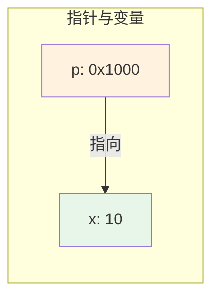

### 6.3 指针与数组

```cpp
int arr[5] = {10, 20, 30, 40, 50};
int* p = arr;  // 数组名即首元素地址

cout << *p << endl;      // 10
cout << *(p+1) << endl;  // 20
cout << p[2] << endl;    // 30
```

### 6.4 动态内存分配

```cpp
// C风格
int* p1 = (int*)malloc(sizeof(int) * 10);
free(p1);

// C++风格
int* p2 = new int;          // 单个对象
int* p3 = new int[10];      // 数组
delete p2;                  // 释放单个对象
delete[] p3;                // 释放数组

// 智能指针 (C++11)
#include <memory>
unique_ptr<int> up(new int(10));
shared_ptr<int> sp = make_shared<int>(20);
```

```mermaid
flowchart TD
    A[动态内存分配] --> B[new/new[]]
    A --> C[malloc]
    
    B --> D[堆内存]
    C --> D
    
    D --> E[delete/delete[]]
    D --> F[free]
    
    D --> G[智能指针<br/>自动释放]
    
    style D fill:#ffebee
    style G fill:#e8f5e9
```

### 6.5 指针与函数

```cpp
// 指针作为参数
void swap(int* a, int* b) {
    int temp = *a;
    *a = *b;
    *b = temp;
}

// 引用作为参数（推荐）
void swap_ref(int& a, int& b) {
    int temp = a;
    a = b;
    b = temp;
}

// 函数指针
int add(int a, int b) { return a + b; }
int (*funcPtr)(int, int) = add;
cout << funcPtr(1, 2) << endl;  // 3

// 使用auto简化 (C++11)
auto funcPtr2 = add;
```

### 6.6 引用

```cpp
int x = 10;
int& ref = x;  // ref是x的别名

ref = 20;  // 修改ref就是修改x
cout << x << endl;  // 20

// 常量引用
const int& cref = x;  // 不能通过cref修改x

// 右值引用 (C++11)
int&& rref = 10;  // 绑定到右值
```

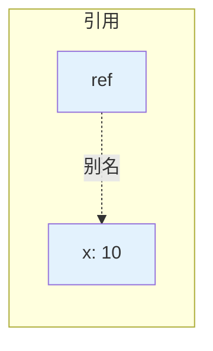

---

# 第二部分 面向对象编程

本部分介绍C++的面向对象编程特性，包括类、对象、继承、多态、模板和STL标准库。

## 第7章 类与对象

### 7.1 类的定义

```cpp
class Person {
private:
    string name;
    int age;

public:
    // 构造函数
    Person(string n, int a) : name(n), age(a) {}
    
    // 默认构造函数
    Person() = default;  // C++11
    
    // 析构函数
    ~Person() {}
    
    // 成员函数
    void setName(string n) { name = n; }
    string getName() const { return name; }
    void setAge(int a) { age = a; }
    int getAge() const { return age; }
    
    // 成员函数声明，外部定义
    void display() const;
};

void Person::display() const {
    cout << "Name: " << name << ", Age: " << age << endl;
}
```

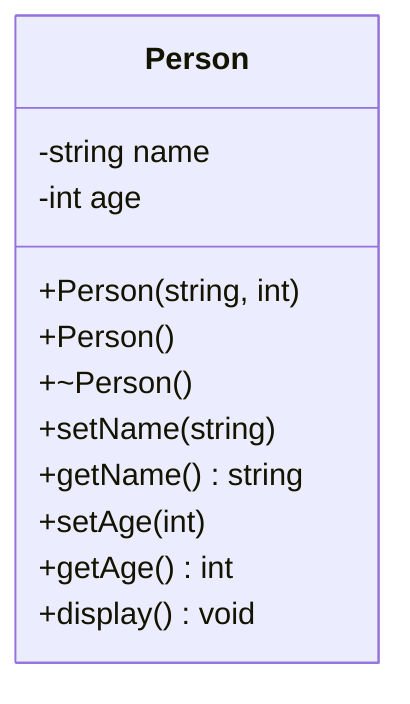

### 7.2 访问修饰符

- **private**：私有成员，只能被类内部访问
- **protected**：受保护成员，可被类和派生类访问
- **public**：公有成员，可被任何地方访问

### 7.3 构造函数

```cpp
class Rectangle {
    int width, height;
public:
    // 默认构造函数
    Rectangle() : width(0), height(0) {}
    
    // 带参数的构造函数
    Rectangle(int w, int h) : width(w), height(h) {}
    
    // 拷贝构造函数
    Rectangle(const Rectangle& other) 
        : width(other.width), height(other.height) {}
    
    // 移动构造函数 (C++11)
    Rectangle(Rectangle&& other) noexcept
        : width(other.width), height(other.height) {
        other.width = 0;
        other.height = 0;
    }
    
    // 委托构造函数 (C++11)
    Rectangle(int size) : Rectangle(size, size) {}
};
```

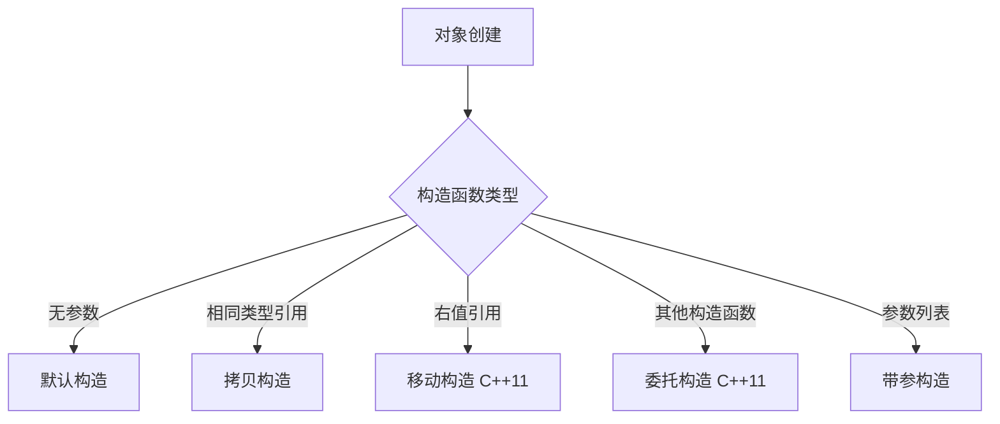

### 7.4 析构函数

```cpp
class Resource {
    int* data;
public:
    Resource() { data = new int[100]; }
    
    // 析构函数
    ~Resource() {
        delete[] data;
        cout << "Resource released" << endl;
    }
};
```

### 7.5 拷贝控制

```cpp
class String {
    char* data;
    size_t len;
public:
    // 拷贝构造函数
    String(const String& other) : len(other.len) {
        data = new char[len + 1];
        strcpy(data, other.data);
    }
    
    // 拷贝赋值运算符
    String& operator=(const String& other) {
        if (this != &other) {
            delete[] data;
            len = other.len;
            data = new char[len + 1];
            strcpy(data, other.data);
        }
        return *this;
    }
    
    // 移动构造函数 (C++11)
    String(String&& other) noexcept 
        : data(other.data), len(other.len) {
        other.data = nullptr;
        other.len = 0;
    }
    
    // 移动赋值运算符 (C++11)
    String& operator=(String&& other) noexcept {
        if (this != &other) {
            delete[] data;
            data = other.data;
            len = other.len;
            other.data = nullptr;
            other.len = 0;
        }
        return *this;
    }
};
```

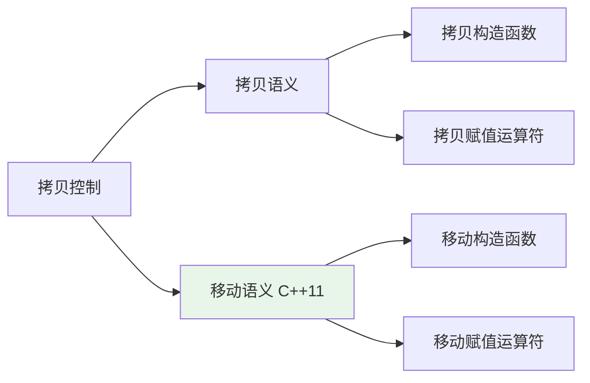

### 7.6 静态成员

```cpp
class Counter {
    static int count;  // 静态成员变量声明
public:
    Counter() { count++; }
    ~Counter() { count--; }
    static int getCount() { return count; }  // 静态成员函数
};

int Counter::count = 0;  // 静态成员变量定义

// 使用
cout << Counter::getCount() << endl;
```

### 7.7 友元

```cpp
class Box {
private:
    int width;
public:
    friend class BoxFactory;  // 友元类
    friend void printWidth(Box& box);  // 友元函数
};

void printWidth(Box& box) {
    cout << box.width << endl;  // 可以访问私有成员
}
```

### 7.8 this指针

```cpp
class Point {
    int x, y;
public:
    Point(int x, int y) {
        this->x = x;  // 区分成员变量和参数
        this->y = y;
    }
    
    Point& setX(int x) {
        this->x = x;
        return *this;  // 支持链式调用
    }
    
    Point& setY(int y) {
        this->y = y;
        return *this;
    }
};

// 链式调用
Point p(0, 0);
p.setX(10).setY(20);
```

---

## 第8章 继承与多态

### 8.1 继承基础

```cpp
// 基类
class Animal {
protected:
    string name;
public:
    Animal(string n) : name(n) {}
    virtual void speak() const {  // 虚函数
        cout << name << " makes a sound" << endl;
    }
    virtual ~Animal() = default;  // 虚析构函数
};

// 派生类
class Dog : public Animal {
public:
    Dog(string n) : Animal(n) {}
    void speak() const override {  // 重写
        cout << name << " barks" << endl;
    }
};

class Cat : public Animal {
public:
    Cat(string n) : Animal(n) {}
    void speak() const override {
        cout << name << " meows" << endl;
    }
};
```

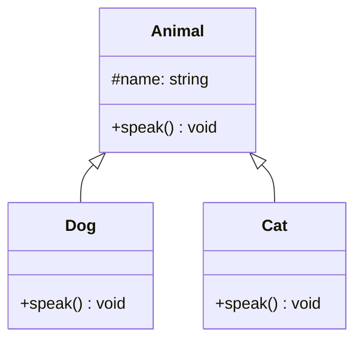

### 8.2 继承类型

```cpp
class Base {
public:
    int publicVar;
protected:
    int protectedVar;
private:
    int privateVar;
};

// public继承：保持原有访问级别
class PublicDerived : public Base {
    // publicVar -> public
    // protectedVar -> protected
    // privateVar -> 不可访问
};

// protected继承：public变为protected
class ProtectedDerived : protected Base {
    // publicVar -> protected
    // protectedVar -> protected
};

// private继承：全部变为private
class PrivateDerived : private Base {
    // publicVar -> private
    // protectedVar -> private
};
```

### 8.3 多态

```cpp
// 基类指针指向派生类对象
Animal* animals[] = {
    new Dog("Buddy"),
    new Cat("Whiskers"),
    new Dog("Rex")
};

// 多态调用
for (auto animal : animals) {
    animal->speak();  // 根据实际对象类型调用相应函数
}

// 清理
for (auto animal : animals) {
    delete animal;
}
```

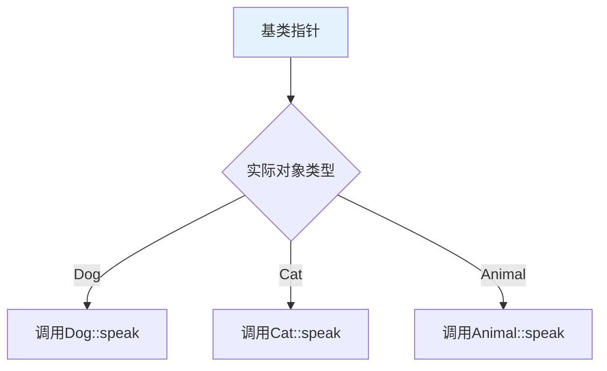

### 8.4 纯虚函数与抽象类

```cpp
// 抽象基类
class Shape {
public:
    virtual double area() const = 0;      // 纯虚函数
    virtual double perimeter() const = 0; // 纯虚函数
    virtual ~Shape() = default;
};

// 具体类
class Circle : public Shape {
    double radius;
public:
    Circle(double r) : radius(r) {}
    double area() const override {
        return 3.14159 * radius * radius;
    }
    double perimeter() const override {
        return 2 * 3.14159 * radius;
    }
};

class Rectangle : public Shape {
    double width, height;
public:
    Rectangle(double w, double h) : width(w), height(h) {}
    double area() const override {
        return width * height;
    }
    double perimeter() const override {
        return 2 * (width + height);
    }
};
```

```mermaid
classDiagram
    <<abstract>> Shape
    Shape <|-- Circle
    Shape <|-- Rectangle
    
    class Shape {
        +area()* double
        +perimeter()* double
    }
    
    class Circle {
        -radius: double
        +area() double
        +perimeter() double
    }
    
    class Rectangle {
        -width: double
        -height: double
        +area() double
        +perimeter() double
    }
```

### 8.5 多重继承

```cpp
class Camera {
public:
    void takePhoto() { cout << "Taking photo" << endl; }
};

class Phone {
public:
    void makeCall() { cout << "Making call" << endl; }
};

class SmartPhone : public Camera, public Phone {
    // 继承自两个基类
};

// 使用
SmartPhone sp;
sp.takePhoto();
sp.makeCall();
```

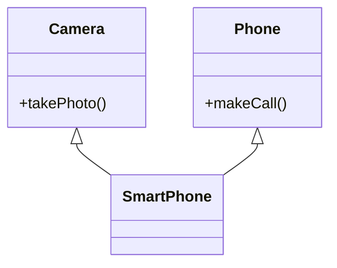

### 8.6 虚继承

```cpp
class Person {
public:
    string name;
};

class Student : virtual public Person {};  // 虚继承
class Employee : virtual public Person {}; // 虚继承

class StudentEmployee : public Student, public Employee {
    // 只有一份Person的副本
};
```

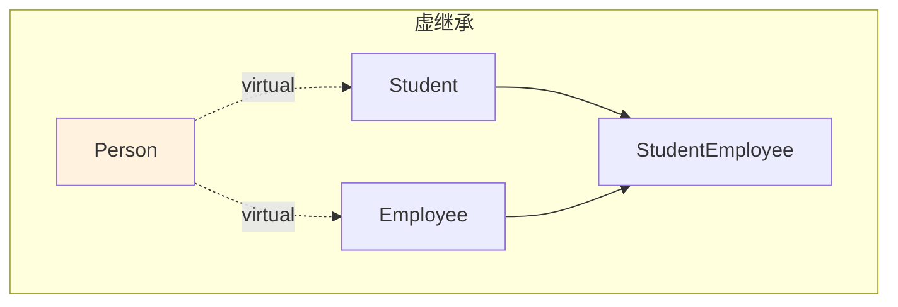

### 8.7 final和override (C++11)

```cpp
class Base {
public:
    virtual void func() {}
    virtual void finalFunc() final {}  // 禁止重写
};

class Derived : public Base {
public:
    void func() override {}  // 显式声明重写
    // void finalFunc() override {}  // 错误！不能重写final函数
};

class FinalClass final {};  // 禁止继承
// class DerivedClass : public FinalClass {};  // 错误！
```

---

## 第9章 模板

### 9.1 函数模板

```cpp
// 函数模板定义
template <typename T>
T max(T a, T b) {
    return (a > b) ? a : b;
}

// 使用
cout << max(3, 5) << endl;        // int
cout << max(3.5, 2.1) << endl;    // double
cout << max('a', 'z') << endl;    // char

// 显式指定类型
cout << max<double>(3, 5.5) << endl;
```

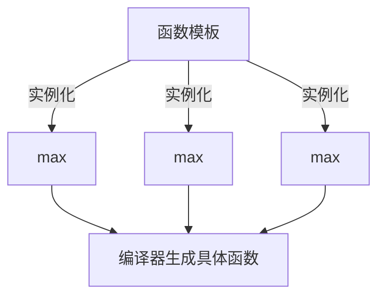

### 9.2 类模板

```cpp
template <typename T, int Size = 10>  // 默认模板参数
class Array {
    T data[Size];
public:
    T& operator[](int index) { return data[index]; }
    int size() const { return Size; }
};

// 使用
Array<int, 5> intArray;
Array<double> doubleArray;  // 使用默认大小10
```

### 9.3 模板特化

```cpp
// 全特化
template <>
class Array<bool, 8> {
    // 针对bool类型的特殊实现
    unsigned char data;
public:
    bool get(int index) const {
        return (data >> index) & 1;
    }
    void set(int index, bool value) {
        if (value) data |= (1 << index);
        else data &= ~(1 << index);
    }
};

// 偏特化
template <typename T>
class Array<T*, 10> {
    // 针对指针类型的特殊实现
};
```

### 9.4 可变参数模板 (C++11)

```cpp
// 递归终止函数
void print() {
    cout << endl;
}

// 可变参数模板
template <typename T, typename... Args>
void print(T first, Args... args) {
    cout << first << " ";
    print(args...);  // 递归调用
}

// 使用
print(1, 2.5, "hello", 'a');  // 1 2.5 hello a

// 折叠表达式 (C++17)
template <typename... Args>
auto sum(Args... args) {
    return (args + ...);  // 一元右折叠
}
```

```mermaid
flowchart TD
    A[print(1, 2.5, "hello", 'a')] --> B[输出 1]
    B --> C[print(2.5, "hello", 'a')]
    C --> D[输出 2.5]
    D --> E[print("hello", 'a')]
    E --> F[输出 hello]
    F --> G[print('a')]
    G --> H[输出 a]
    H --> I[print()]
    I --> J[输出换行]
```

### 9.5 typename关键字

```cpp
template <typename T>
void func() {
    // 依赖名需要使用typename
    typename T::iterator it;
}

// 在模板参数中，class和typename等价
template <class T>  // 等同于 typename T
void func2() {}
```

---

## 第10章 STL标准库

### 10.1 STL概述

STL（Standard Template Library）是C++标准库的重要组成部分，提供了通用的数据结构和算法。STL包含六大组件：

- **容器（Containers）**：vector、list、map等
- **算法（Algorithms）**：sort、find、copy等
- **迭代器（Iterators）**：访问容器元素的通用接口
- **函数对象（Function Objects）**：重载operator()的类
- **适配器（Adapters）**：stack、queue等
- **分配器（Allocators）**：内存管理

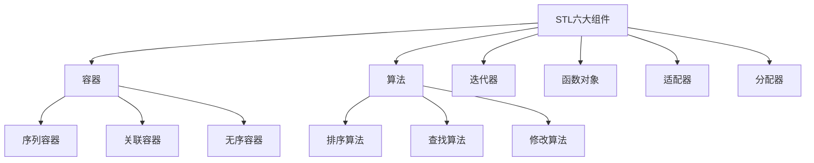

### 10.2 序列容器

```cpp
#include <vector>
#include <list>
#include <deque>

// vector：动态数组
vector<int> vec = {1, 2, 3, 4, 5};
vec.push_back(6);
vec.pop_back();
cout << vec[0] << endl;  // 随机访问
vec.insert(vec.begin() + 2, 10);
vec.erase(vec.begin());

// list：双向链表
list<int> lst = {1, 2, 3};
lst.push_back(4);
lst.push_front(0);
lst.sort();
lst.reverse();

// deque：双端队列
deque<int> deq;
deq.push_back(1);
deq.push_front(2);
```

```mermaid
flowchart LR
    subgraph vector内存布局
        V0[0]
        V1[1]
        V2[2]
        V3[3]
        V4[4]
        V5[...]
    end
    
    V0 --- V1 --- V2 --- V3 --- V4 --- V5
    
    style V0 fill:#e3f2fd
    style V1 fill:#e3f2fd
    style V2 fill:#e3f2fd
    style V3 fill:#e3f2fd
    style V4 fill:#e3f2fd
```

### 10.3 关联容器

```cpp
#include <set>
#include <map>

// set：有序唯一集合
set<int> s = {3, 1, 4, 1, 5};  // {1, 3, 4, 5}
s.insert(2);
s.erase(3);
if (s.find(4) != s.end()) {
    cout << "Found" << endl;
}

// multiset：有序可重复集合
multiset<int> ms = {1, 1, 2, 2, 3};

// map：键值对映射
map<string, int> scores;
scores["Alice"] = 90;
scores["Bob"] = 85;
scores.insert({"Charlie", 95});

for (const auto& pair : scores) {
    cout << pair.first << ": " << pair.second << endl;
}

// unordered_map：哈希表实现的map (C++11)
#include <unordered_map>
unordered_map<string, int> hashMap;
```

```mermaid
flowchart TD
    subgraph map红黑树结构
        R[key: Bob] --> L[key: Alice]
        R --> RR[key: Charlie]
    end
    
    style R fill:#e8f5e9
    style L fill:#e8f5e9
    style RR fill:#e8f5e9
```

### 10.4 容器适配器

```cpp
#include <stack>
#include <queue>

// stack：后进先出
stack<int> stk;
stk.push(1);
stk.push(2);
cout << stk.top() << endl;  // 2
stk.pop();

// queue：先进先出
queue<int> q;
q.push(1);
q.push(2);
cout << q.front() << endl;  // 1
q.pop();

// priority_queue：优先队列
priority_queue<int> pq;  // 默认大顶堆
pq.push(3);
pq.push(1);
pq.push(4);
cout << pq.top() << endl;  // 4
```

```mermaid
flowchart TD
    subgraph stack
        S1[2] --> S2[1]
        direction TB
    end
    
    subgraph queue
        Q1[1] --> Q2[2]
        direction LR
    end
    
    subgraph priority_queue
        P1[4]
        P2[1]
        P3[3]
        P1 --> P2
        P1 --> P3
    end
    
    style S1 fill:#ffebee
    style Q1 fill:#e3f2fd
    style P1 fill:#fff3e0
```

### 10.5 迭代器

```cpp
vector<int> vec = {1, 2, 3, 4, 5};

// 迭代器遍历
for (auto it = vec.begin(); it != vec.end(); ++it) {
    cout << *it << endl;
}

// 反向迭代器
for (auto it = vec.rbegin(); it != vec.rend(); ++it) {
    cout << *it << endl;
}

// 常量迭代器
for (auto it = vec.cbegin(); it != vec.cend(); ++it) {
    // *it = 10;  // 错误！不能修改
}

// 范围for循环 (C++11)
for (const auto& elem : vec) {
    cout << elem << endl;
}
```

```mermaid
flowchart LR
    A[begin] --> B[元素1]
    B --> C[元素2]
    C --> D[元素3]
    D --> E[end]
    
    style A fill:#e8f5e9
    style E fill:#ffebee
```

### 10.6 常用算法

```cpp
#include <algorithm>
#include <numeric>

vector<int> vec = {3, 1, 4, 1, 5, 9, 2, 6};

// 排序
sort(vec.begin(), vec.end());  // 升序
sort(vec.begin(), vec.end(), greater<int>());  // 降序

// 查找
auto it = find(vec.begin(), vec.end(), 5);
if (it != vec.end()) cout << "Found" << endl;

// 二分查找（需要先排序）
bool found = binary_search(vec.begin(), vec.end(), 5);

// 复制
vector<int> dest(vec.size());
copy(vec.begin(), vec.end(), dest.begin());

// 填充
fill(vec.begin(), vec.end(), 0);

// 累加
int sum = accumulate(vec.begin(), vec.end(), 0);

// 计数
int count = count_if(vec.begin(), vec.end(), 
    [](int x) { return x > 5; });
```

### 10.7 Lambda表达式与算法

```cpp
vector<int> vec = {1, 2, 3, 4, 5, 6, 7, 8, 9, 10};

// 使用lambda自定义排序
sort(vec.begin(), vec.end(), 
    [](int a, int b) { return a > b; });  // 降序

// for_each
for_each(vec.begin(), vec.end(), 
    [](int x) { cout << x * x << endl; });

// transform
vector<int> squares(vec.size());
transform(vec.begin(), vec.end(), squares.begin(),
    [](int x) { return x * x; });

// remove_if
auto new_end = remove_if(vec.begin(), vec.end(),
    [](int x) { return x % 2 == 0; });  // 移除偶数
vec.erase(new_end, vec.end());
```

### 10.8 智能指针

```cpp
#include <memory>

// unique_ptr：独占所有权
unique_ptr<int> up1(new int(10));
auto up2 = make_unique<int>(20);  // C++14推荐
// unique_ptr<int> up3 = up1;  // 错误！不能复制
unique_ptr<int> up4 = move(up1);  // 可以移动

// shared_ptr：共享所有权
shared_ptr<int> sp1 = make_shared<int>(30);
shared_ptr<int> sp2 = sp1;  // 引用计数+1
cout << sp1.use_count() << endl;  // 2

// weak_ptr：弱引用
weak_ptr<int> wp = sp1;
if (auto sp = wp.lock()) {  // 使用前需要lock
    cout << *sp << endl;
}

// 自定义删除器
unique_ptr<FILE, decltype(&fclose)> file(
    fopen("test.txt", "r"), fclose);
```

```mermaid
flowchart TD
    subgraph unique_ptr
        U1[unique_ptr] -->|独占| R1[资源]
    end
    
    subgraph shared_ptr
        S1[shared_ptr] -->|引用计数=2| R2[资源]
        S2[shared_ptr] --> R2
    end
    
    subgraph weak_ptr
        W1[weak_ptr] -.->|弱引用| R2
    end
    
    style U1 fill:#e3f2fd
    style S1 fill:#e8f5e9
    style S2 fill:#e8f5e9
    style W1 fill:#fff3e0
```

---

# 第三部分 C++11新特性

C++11是C++语言的一次重大更新，引入了大量现代编程特性，被称为「现代C++」的开端。

## 3.1 auto类型推导

auto关键字允许编译器自动推导变量类型，简化代码书写。

```cpp
// 基本用法
auto i = 42;           // int
auto d = 3.14;         // double
auto s = "hello";      // const char*
auto v = {1, 2, 3};    // std::initializer_list<int>

// 迭代器简化
vector<int> vec = {1, 2, 3};
for (auto it = vec.begin(); it != vec.end(); ++it) {
    cout << *it << endl;
}
```

## 3.2 decltype

decltype用于获取表达式的类型。

```cpp
int x = 42;
decltype(x) y = 100;  // y的类型是int

const int& rx = x;
decltype(rx) rz = x;  // rz的类型是const int&
```

## 3.3 nullptr

nullptr是C++11引入的空指针常量，类型安全的替代NULL。

```cpp
void foo(int x) { cout << "int" << endl; }
void foo(int* p) { cout << "pointer" << endl; }

foo(NULL);      // 可能调用foo(int)，有歧义
foo(nullptr);   // 明确调用foo(int*)，类型安全
```

```mermaid
flowchart LR
    A[NULL] -->|宏定义 0| B[可能匹配 int]
    A -->|也可能匹配| C[int*]
    
    D[nullptr] -->|类型安全| E[只能匹配 int*]
    
    style A fill:#ffebee
    style D fill:#e8f5e9
```

## 3.4 范围for循环

范围for循环简化了容器遍历。

```cpp
vector<int> vec = {1, 2, 3, 4, 5};

// 只读遍历
for (const auto& elem : vec) {
    cout << elem << endl;
}

// 修改元素
for (auto& elem : vec) {
    elem *= 2;
}
```

## 3.5 Lambda表达式

Lambda表达式允许定义匿名函数对象。

```cpp
// 基本语法
auto lambda = [](int x, int y) -> int {
    return x + y;
};

// 捕获列表
int a = 10, b = 20;
auto f1 = [a, b]() { return a + b; };      // 值捕获
auto f2 = [&a, &b]() { return a + b; };    // 引用捕获
auto f3 = [=]() { return a + b; };         // 隐式值捕获
auto f4 = [&]() { return a + b; };         // 隐式引用捕获
```

## 3.6 右值引用与移动语义

右值引用（&&）支持移动语义，避免不必要的拷贝。

```cpp
// 移动构造函数
class String {
    char* data;
public:
    // 拷贝构造函数
    String(const String& other) {
        data = new char[strlen(other.data) + 1];
        strcpy(data, other.data);
    }
    
    // 移动构造函数
    String(String&& other) noexcept {
        data = other.data;      // 窃取资源
        other.data = nullptr;   // 置空源对象
    }
};

// std::move
String s1 = "Hello";
String s2 = std::move(s1);  // 调用移动构造函数
```

```mermaid
flowchart LR
    subgraph 拷贝构造
        C1[源对象] -->|深拷贝| C2[新对象]
        C3[堆内存1] 
        C4[堆内存2]
    end
    
    subgraph 移动构造
        M1[源对象] -->|资源转移| M2[新对象]
        M3[堆内存]
        M1 -.->|置空| M4[nullptr]
    end
    
    style C1 fill:#ffebee
    style M2 fill:#e8f5e9
```

## 3.7 智能指针

C++11提供了三种智能指针，自动管理内存。

```cpp
#include <memory>

// unique_ptr：独占所有权
unique_ptr<int> up1(new int(10));
auto up2 = make_unique<int>(20);  // C++14

// shared_ptr：共享所有权
shared_ptr<int> sp1 = make_shared<int>(30);
shared_ptr<int> sp2 = sp1;

// weak_ptr：弱引用
weak_ptr<int> wp = sp1;
if (auto sp = wp.lock()) {
    cout << *sp << endl;
}
```

## 3.8 初始化列表

统一初始化语法，使用花括号{}。

```cpp
// 基本类型
int x{10};
double d{3.14};

// 容器
vector<int> vec{1, 2, 3, 4, 5};
map<string, int> m{{"a", 1}, {"b", 2}};

// 防止窄化转换
// int bad{3.14};  // 错误！
```

## 3.9 委托构造函数

构造函数可以调用同一个类的其他构造函数。

```cpp
class Person {
    string name;
    int age;
public:
    Person(string n, int a) : name(n), age(a) {}
    Person(string n) : Person(n, 0) {}  // 委托
    Person() : Person("Unknown", 0) {}  // 委托
};
```

## 3.10 继承构造函数

派生类可以继承基类的构造函数。

```cpp
class Base {
public:
    Base(int x) {}
    Base(int x, int y) {}
};

class Derived : public Base {
public:
    using Base::Base;  // 继承所有构造函数
};
```

## 3.11 override和final

显式控制虚函数的重写和禁止。

```cpp
class Base {
public:
    virtual void func() {}
    virtual void finalFunc() final {}  // 禁止重写
};

class Derived : public Base {
public:
    void func() override {}  // 显式声明重写
};

class FinalClass final {};  // 禁止继承
```

## 3.12 默认和删除函数

显式控制特殊成员函数的生成。

```cpp
class Example {
public:
    Example() = default;
    Example(const Example&) = default;
    Example& operator=(const Example&) = delete;  // 禁止拷贝
    Example(Example&&) = default;
    Example& operator=(Example&&) = delete;  // 禁止移动
};
```

## 3.13 强类型枚举

enum class提供作用域和类型安全。

```cpp
// 传统枚举
enum Color { RED, GREEN, BLUE };

// 强类型枚举
enum class Color { RED, GREEN, BLUE };
Color c = Color::RED;  // 需要作用域运算符
int x = static_cast<int>(Color::RED);  // 需要显式转换
```

## 3.14 constexpr

编译期常量表达式。

```cpp
// constexpr变量
constexpr int size = 100;
int arr[size];  // OK

// constexpr函数
constexpr int square(int x) {
    return x * x;
}
constexpr int result = square(5);  // 编译期计算
```

## 3.15 noexcept

指定函数不抛出异常。

```cpp
void safeFunc() noexcept {
    // 如果抛出异常，程序会terminate
}
```

## 3.16 类型别名

using提供更清晰的类型别名语法。

```cpp
// using别名
template <typename T>
using Vec = std::vector<T>;

Vec<int> v;  // 等价于 vector<int>
```

## 3.17 变长模板

支持可变数量模板参数。

```cpp
void print() { cout << endl; }

template <typename T, typename... Args>
void print(T first, Args... args) {
    cout << first << " ";
    print(args...);
}

print(1, 2.5, "hello", 'a');  // 1 2.5 hello a
```

## 3.18 用户定义字面量

自定义字面量后缀。

```cpp
constexpr long long operator"" _km(long long meters) {
    return meters * 1000;
}

auto distance = 5_km;  // 5000
```

## 3.19 线程支持

C++11引入了标准线程库。

```cpp
#include <thread>
#include <mutex>
#include <future>

// 基本线程
thread t1([]() { cout << "Thread 1" << endl; });
t1.join();

// mutex
mutex mtx;
lock_guard<mutex> lock(mtx);  // RAII锁

// future和async
future<int> result = async(launch::async, []() { return 42; });
cout << result.get() << endl;
```

```mermaid
flowchart TD
    A[线程创建] --> B[thread对象]
    B --> C[执行任务]
    C --> D[join/detach]
    
    E[同步机制] --> F[mutex]
    E --> G[condition_variable]
    E --> H[future/promise]
    
    F --> F1[lock_guard]
    F --> F2[unique_lock]
```

## 3.20 随机数生成

新的随机数库替代rand()。

```cpp
#include <random>

random_device rd;
mt19937 gen(rd());
uniform_int_distribution<> dis(1, 6);
cout << dis(gen) << endl;  // 掷骰子
```

## 3.21 时间库

chrono库提供时间处理。

```cpp
#include <chrono>

auto start = high_resolution_clock::now();
// ... 执行操作
auto end = high_resolution_clock::now();
auto duration = duration_cast<milliseconds>(end - start);
```

## 3.22 元组

tuple用于存储不同类型的固定数量元素。

```cpp
#include <tuple>

tuple<int, string, double> t = make_tuple(1, "one", 1.1);
cout << get<0>(t) << endl;  // 1

// 解包
int i; string s; double d;
tie(i, s, d) = t;
```

## 3.23 正则表达式

regex库提供正则表达式支持。

```cpp
#include <regex>

regex pattern("\\d+");
string text = "Age: 25";
if (regex_search(text, pattern)) {
    cout << "Found number" << endl;
}
```

## 3.24 静态断言

static_assert用于编译期断言。

```cpp
static_assert(sizeof(int) == 4, "int must be 4 bytes");
```

---

# 第四部分 C++14新特性

C++14是对C++11的小幅更新，主要修复了一些问题并引入了一些便利特性。

## 4.1 泛型Lambda

Lambda参数可以使用auto。

```cpp
// C++14：泛型lambda
auto add = [](auto a, auto b) { return a + b; };

cout << add(1, 2) << endl;        // int
cout << add(1.5, 2.5) << endl;    // double
```

## 4.2 Lambda捕获初始化

可以在捕获列表中初始化变量。

```cpp
int x = 10;
auto f = [y = x + 1]() { return y * 2; };  // y = 11

// 移动捕获
unique_ptr<int> ptr(new int(10));
auto f2 = [p = move(ptr)]() { return *p; };
```

## 4.3 变量模板

可以定义变量模板。

```cpp
template <typename T>
constexpr T pi = T(3.1415926535897932385);

cout << pi<double> << endl;  // 3.14159...
```

## 4.4 constexpr函数增强

constexpr函数限制大幅放宽。

```cpp
// C++14：可以使用局部变量、循环
constexpr int factorial(int n) {
    int result = 1;
    for (int i = 1; i <= n; ++i) {
        result *= i;
    }
    return result;
}

static_assert(factorial(5) == 120);
```

## 4.5 二进制字面量

支持二进制表示。

```cpp
int binary = 0b1010;  // 十进制10
int flags = 0b1111'0000;
```

## 4.6 数字分隔符

单引号'可以作为数字分隔符。

```cpp
int million = 1'000'000;
double pi = 3.141'592'653'589;
```

## 4.7 返回类型推导

普通函数可以推导返回类型。

```cpp
template <typename T, typename U>
auto add(T t, U u) {  // 返回类型自动推导
    return t + u;
}
```

## 4.8 make_unique

C++14添加了make_unique函数。

```cpp
unique_ptr<int> up = make_unique<int>(42);
```

---

# 第五部分 C++17新特性

C++17是一次重要的更新，引入了许多实用特性，使代码更简洁、更安全。

## 5.1 结构化绑定

解构tuple、pair、struct等。

```cpp
// tuple解构
tuple<int, string, double> t = {1, "one", 1.1};
auto [i, s, d] = t;

// pair解构
map<int, string> m = {{1, "one"}};
for (const auto& [key, value] : m) {
    cout << key << ": " << value << endl;
}

// struct解构
struct Point { int x; int y; };
Point p = {10, 20};
auto [x, y] = p;
```

```mermaid
flowchart LR
    A[tuple<int, string, double>] -->|结构化绑定| B[i: int]
    A --> C[s: string]
    A --> D[d: double]
    
    style A fill:#e3f2fd
    style B fill:#e8f5e9
    style C fill:#e8f5e9
    style D fill:#e8f5e9
```

## 5.2 if/switch初始化语句

if和switch可以包含初始化语句。

```cpp
// if with initializer
if (auto it = m.find(key); it != m.end()) {
    cout << it->second << endl;
}
// it在这里不可见

// 结合结构化绑定
if (auto [it, inserted] = m.insert({key, value}); inserted) {
    cout << "Inserted" << endl;
}
```

## 5.3 constexpr if

编译期条件分支。

```cpp
template <typename T>
auto get_value(T t) {
    if constexpr (std::is_pointer_v<T>) {
        return *t;
    } else {
        return t;
    }
}
```

## 5.4 折叠表达式

简化变长模板参数处理。

```cpp
// 一元右折叠
template <typename... Args>
auto sum(Args... args) {
    return (args + ...);
}

// 一元左折叠
template <typename... Args>
auto sum_left(Args... args) {
    return (... + args);
}
```

## 5.5 内联变量

允许在头文件中定义变量。

```cpp
inline int global_counter = 0;  // 所有翻译单元共享

// 类的静态成员inline初始化
struct Foo {
    static inline int count = 0;
};
```

## 5.6 嵌套命名空间

简化嵌套命名空间定义。

```cpp
// C++17：简洁语法
namespace A::B::C {
    void func() {}
}
```

## 5.7 类模板参数推导

类模板可以自动推导模板参数。

```cpp
pair p3(1, "one");  // pair<int, string>
tuple t(1, 2.0, "three");  // tuple<int, double, const char*>
vector v1 = {1, 2, 3};  // vector<int>
```

## 5.8 std::string_view

轻量级字符串引用，零拷贝。

```cpp
#include <string_view>

void print(string_view sv) {
    cout << sv << endl;  // 无拷贝
}

string s = "Hello World";
print(s);           // 从string构造
print("Literal");   // 从字面量构造
```

```mermaid
flowchart LR
    A[string_view] -.->|引用| B[原字符串]
    
    C[string] -->|拷贝| D[新内存]
    
    style A fill:#e8f5e9
    style C fill:#ffebee
```

## 5.9 std::optional

表示可能不存在的值。

```cpp
#include <optional>

optional<int> parse_int(const string& s) {
    try {
        return stoi(s);
    } catch (...) {
        return nullopt;
    }
}

auto result = parse_int("42");
if (result) {
    cout << *result << endl;
}
cout << result.value_or(0) << endl;
```

```mermaid
flowchart TD
    A[optional<T>] -->|有值| B[包含T对象]
    A -->|nullopt| C[空状态]
    
    style A fill:#e3f2fd
    style B fill:#e8f5e9
    style C fill:#fff3e0
```

## 5.10 std::variant

类型安全的联合体。

```cpp
#include <variant>

variant<int, double, string> v;
v = 42;
v = 3.14;
v = "hello";

// 使用访问者
visit([](auto&& arg) {
    cout << arg << endl;
}, v);
```

## 5.11 std::any

类型擦除容器，可存储任意类型。

```cpp
#include <any>

any a = 42;
a = 3.14;
a = string("hello");

try {
    string s = any_cast<string>(a);
} catch (const bad_any_cast& e) {
    cout << "Type mismatch" << endl;
}
```

## 5.12 文件系统库

标准文件系统操作。

```cpp
#include <filesystem>
namespace fs = std::filesystem;

fs::path p = "/home/user/file.txt";
cout << p.filename() << endl;
cout << p.extension() << endl;

for (const auto& entry : fs::directory_iterator(".")) {
    cout << entry.path() << endl;
}
```

## 5.13 并行算法

STL算法支持并行执行。

```cpp
#include <execution>

vector<int> v(1000000);

// 并行执行
sort(execution::par, v.begin(), v.end());

// 并行reduce
int sum = reduce(execution::par, v.begin(), v.end());
```

```mermaid
flowchart TD
    A[执行策略] --> B[seq<br/>顺序]
    A --> C[par<br/>并行]
    A --> D[par_unseq<br/>并行+向量化]
    A --> E[unseq<br/>向量化]
    
    style C fill:#e8f5e9
    style D fill:#e8f5e9
```

## 5.14 其他新特性

```cpp
// 十六进制浮点字面量
double hex_float = 0x1.2p3;

// [[nodiscard]]
[[nodiscard]] int must_use();

// [[maybe_unused]]
[[maybe_unused]] void unused();
```

---

# 第六部分 C++20新特性

C++20是一次重大更新，引入了许多革命性特性，包括概念、协程、模块、范围等。

## 6.1 概念（Concepts）

概念用于约束模板参数，提供清晰的编译错误信息。

```cpp
#include <concepts>

// 定义概念
template <typename T>
concept Arithmetic = is_arithmetic_v<T>;

// 使用概念约束模板
template <Arithmetic T>
T add(T a, T b) {
    return a + b;
}

// 简写语法
void print(Arithmetic auto x) {
    cout << x << endl;
}
```

```mermaid
flowchart TD
    A[模板参数T] -->|约束| B{满足Concept?}
    B -->|是| C[编译通过]
    B -->|否| D[编译错误<br/>清晰的错误信息]
    
    style C fill:#e8f5e9
    style D fill:#ffebee
```

## 6.2 范围（Ranges）

新的范围库，支持管道操作。

```cpp
#include <ranges>
namespace rv = std::ranges::views;

vector<int> v = {1, 2, 3, 4, 5, 6, 7, 8, 9, 10};

auto result = v 
    | rv::filter([](int x) { return x % 2 == 0; })
    | rv::transform([](int x) { return x * x; })
    | rv::take(3);

// 输出: 4 16 36
```

```mermaid
flowchart LR
    A[原始范围] -->|filter<br/>偶数| B
    B -->|transform<br/>平方| C
    C -->|take<br/>前3个| D[结果]
    
    style A fill:#e3f2fd
    style D fill:#e8f5e9
```

## 6.3 协程（Coroutines）

支持异步编程的协程机制。

```cpp
#include <coroutine>

// 生成器
template <typename T>
struct Generator {
    struct promise_type {
        T current_value;
        auto yield_value(T value) {
            current_value = value;
            return std::suspend_always{};
        }
    };
    // ...
};

// 生成斐波那契数列
Generator<int> fibonacci() {
    int a = 0, b = 1;
    while (true) {
        co_yield a;
        int temp = a + b;
        a = b;
        b = temp;
    }
}
```

```mermaid
sequenceDiagram
    participant Caller
    participant Coroutine
    
    Caller->>Coroutine: 调用协程
    Coroutine->>Caller: co_yield 值1 (挂起)
    Caller->>Coroutine: 恢复执行
    Coroutine->>Caller: co_yield 值2 (挂起)
    Caller->>Coroutine: 恢复执行
    Coroutine->>Caller: co_yield 值3 (挂起)
```

## 6.4 模块（Modules）

替代头文件的模块系统。

```cpp
// math.ixx (模块接口文件)
export module math;

export int add(int a, int b) {
    return a + b;
}

// main.cpp
import math;

int main() {
    cout << add(1, 2) << endl;
    return 0;
}
```

```mermaid
flowchart LR
    subgraph 传统头文件
        H1[.h] -->|文本包含| C1[编译单元]
        H1 -->|文本包含| C2[编译单元]
        H1 -->|文本包含| C3[编译单元]
    end
    
    subgraph 模块
        M1[.ixx] -->|导入| D1[编译单元]
        M1 -->|导入| D2[编译单元]
        M1 -->|导入| D3[编译单元]
    end
    
    style M1 fill:#e8f5e9
```

## 6.5 三路比较运算符

<=>运算符统一比较语义。

```cpp
struct Point {
    int x, y;
    auto operator<=>(const Point&) const = default;
    // 自动生成 ==, !=, <, <=, >, >=
};
```

## 6.6 指定初始化

指定成员名称进行初始化。

```cpp
struct Config {
    int width = 800;
    int height = 600;
    string title = "Window";
};

Config c1{
    .width = 1920,
    .height = 1080,
    .title = "My Game"
};
```

## 6.7 Lambda增强

C++20对Lambda的多项增强。

```cpp
// 模板Lambda
auto lambda = []<typename T>(T a, T b) {
    return a + b;
};

// 有状态的constexpr Lambda
constexpr auto add = [](int a, int b) constexpr {
    return a + b;
};
constexpr int result = add(1, 2);
```

## 6.8 constexpr增强

constexpr功能大幅扩展。

```cpp
// C++20：constexpr虚函数
struct Base {
    constexpr virtual int get() const { return 1; }
};

constexpr Base* create() {
    return new Derived();  // constexpr new
}

constexpr int test() {
    Base* p = create();
    int result = p->get();
    delete p;  // constexpr delete
    return result;
}
```

## 6.9 consteval

consteval强制编译期求值。

```cpp
consteval int must_compile_time(int x) {
    return x * 2;
}

int c = must_compile_time(10);  // OK
// int b = must_compile_time(runtime_val);  // 错误！
```

## 6.10 constinit

constinit强制常量初始化。

```cpp
constinit int global = 42;  // 编译期初始化

// 可以修改
void func() { global = 20; }  // OK
```

## 6.11 格式化库（std::format）

类型安全的格式化字符串。

```cpp
#include <format>

string s1 = format("Hello, {}!", "World");
string s2 = format("The answer is {}", 42);
string s3 = format("{:05d}", 42);      // 00042
string s4 = format("{:.2f}", 3.14159); // 3.14
```

## 6.12 日历和时区

标准日历和时区支持。

```cpp
#include <chrono>

year_month_day date = 2024y/March/15d;
cout << date << endl;  // 2024-03-15

auto zt = zoned_time{current_zone(), system_clock::now()};
cout << zt << endl;
```

## 6.13 span

连续序列的非拥有视图。

```cpp
#include <span>

void process(span<int> data) {
    for (auto& x : data) {
        x *= 2;
    }
}

int arr[] = {1, 2, 3, 4, 5};
process(arr);  // 无拷贝
```

## 6.14 bit操作

标准位操作库。

```cpp
#include <bit>

int count = popcount(x);        // 1的个数
int width = bit_width(15u);     // 表示所需位数
int ceil = bit_ceil(5u);        // 2的幂向上取整

// 字节交换
uint16_t swapped = byteswap<uint16_t>(0x1234);
```

## 6.15 其他重要特性

```cpp
// using enum
enum class Color { Red, Green, Blue };
void func() {
    using enum Color;
    Color c = Red;
}

// [[likely]] / [[unlikely]]
if (condition) [[likely]] {
    // 更可能执行
}

// 数学常量
#include <numbers>
double pi = numbers::pi;
double e = numbers::e;

// source_location
void log(string_view msg, 
         source_location loc = source_location::current());
```

---

# 附录：C++标准特性速查表

```mermaid
flowchart TD
    subgraph C++11["C++11 核心特性"]
        C11_1[auto/decltype]
        C11_2[nullptr]
        C11_3[范围for]
        C11_4[Lambda]
        C11_5[右值引用]
        C11_6[智能指针]
        C11_7[初始化列表]
        C11_8[constexpr]
        C11_9[线程库]
    end
    
    subgraph C++14["C++14 增强"]
        C14_1[泛型Lambda]
        C14_2[变量模板]
        C14_3[constexpr增强]
        C14_4[make_unique]
    end
    
    subgraph C++17["C++17 实用特性"]
        C17_1[结构化绑定]
        C17_2[if初始化]
        C17_3[constexpr if]
        C17_4[折叠表达式]
        C17_5[string_view]
        C17_6[optional/variant]
        C17_7[文件系统]
    end
    
    subgraph C++20["C++20 革命性特性"]
        C20_1[Concepts]
        C20_2[Ranges]
        C20_3[Coroutines]
        C20_4[Modules]
        C20_5[<=>运算符]
        C20_6[format]
        C20_7[span]
    end
    
    C11_1 --> C14_1
    C11_4 --> C14_1
    C11_8 --> C14_3
    C11_6 --> C14_4
    
    C14_1 --> C17_1
    C14_3 --> C17_3
    
    C17_1 --> C20_1
    C17_5 --> C20_7
```

---

> **学习建议**
> 
> 1. 先掌握C++基础（第一部分）
> 2. 深入理解面向对象编程（第二部分）
> 3. 逐步学习现代C++特性（第三至六部分）
> 4. 多写代码，多实践
> 5. 阅读优秀的C++开源项目

---

*本文档基于C++11/14/17/20标准整理，使用编译器时请确保支持相应的C++标准。*
